# Docker Network Security Lab

A Docker-based enterprise network environment designed to simulate real-world network segmentation and security controls.

This project demonstrates how Docker can be used to build a multi-segment network with dedicated routing, authentication, VPN access, malware scanning, and a DMZ-hosted web application.

---

# Why This Project?

The goal of this project was to gain hands-on experience with:

* Linux administration
* Docker networking
* Static routing
* Network segmentation
* VPN technologies
* Authentication systems
* Security monitoring
* Infrastructure troubleshooting

Rather than deploying individual containers, the objective was to design a small enterprise-style environment where traffic must traverse multiple network zones and security controls.

---

# Skills Demonstrated

### Linux Administration

* Container administration
* Network troubleshooting
* Route configuration
* Service validation

### Docker

* Multi-network container deployments
* Custom bridge networks
* Container connectivity
* Network isolation

### Networking

* Static routing
* IP addressing
* Traceroute analysis
* Network segmentation
* DMZ architecture

### Security

* WireGuard VPN
* Authelia Single Sign-On (SSO)
* ClamAV malware scanning
* Segmented network design

### Documentation

* Network topology diagrams
* Technical documentation
* Infrastructure validation
* Troubleshooting records

---

# Architecture Overview

The environment consists of three isolated network segments connected by dedicated routing containers.

| Network            | Subnet        | Purpose                     |
| ------------------ | ------------- | --------------------------- |
| Management Network | 172.20.0.0/24 | Administrative systems      |
| Internal Network   | 172.21.0.0/24 | Routing and transit network |
| DMZ Network        | 172.22.0.0/24 | Public-facing services      |

---

# Network Topology

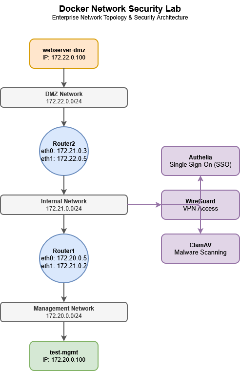

---

# Components

| Component     | Address                 |
| ------------- | ----------------------- |
| test-mgmt     | 172.20.0.100            |
| Router1       | 172.20.0.5 / 172.21.0.2 |
| Router2       | 172.21.0.3 / 172.22.0.5 |
| webserver-dmz | 172.22.0.100            |

---

# Security Components

## Authelia

Provides centralized authentication and Single Sign-On (SSO) capabilities.

Features:

* Centralized authentication
* Session management
* Access control
* Identity verification

---

## WireGuard

Provides secure VPN access into the environment.

Features:

* Encrypted communication
* Secure remote administration
* Lightweight VPN implementation

---

## ClamAV

Provides malware scanning capabilities.

Features:

* Malware detection
* Signature-based scanning
* Security validation

---

# Routing Validation

Static routes were configured between Router1 and Router2.

### Router1

```text
172.22.0.0/24 via 172.21.0.3
```

### Router2

```text
172.20.0.0/24 via 172.21.0.2
```

Traffic validation was performed using:

* Ping
* Traceroute
* Route inspection

The following path was successfully verified:

```text
test-mgmt
↓
Router1
↓
Router2
↓
webserver-dmz
```

---

# Screenshots

## Running Containers

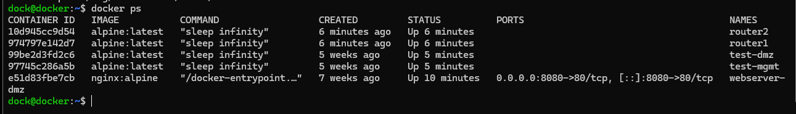

## Docker Networks

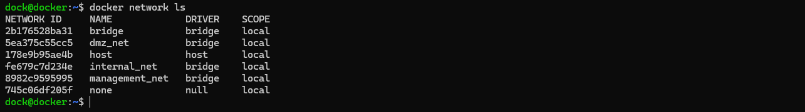

## Router1 Configuration

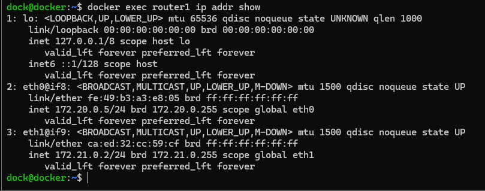

## Router2 Configuration

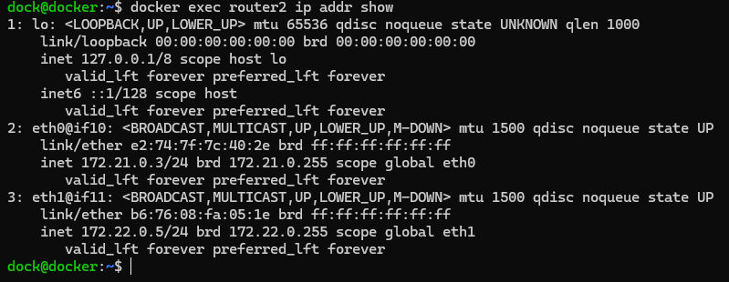

## Router1 Routing Table

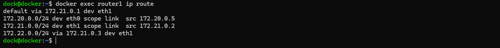

## Router2 Routing Table

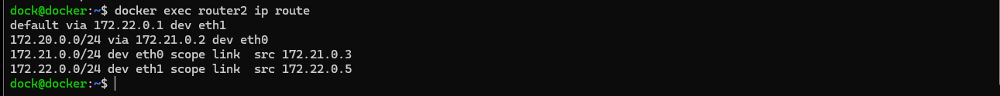

## Routing Validation

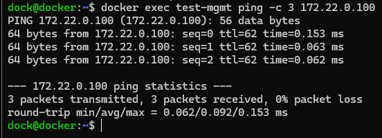

## Traceroute Validation

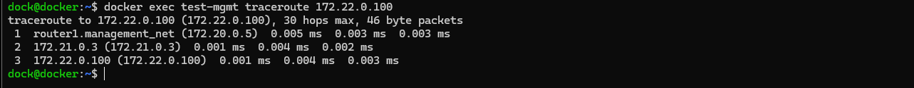

## Authelia

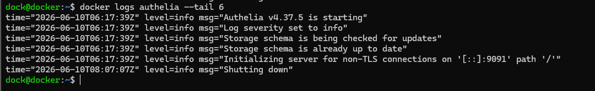

## WireGuard

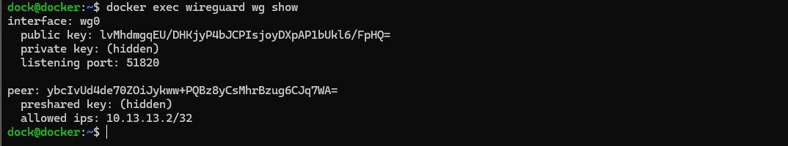

## ClamAV

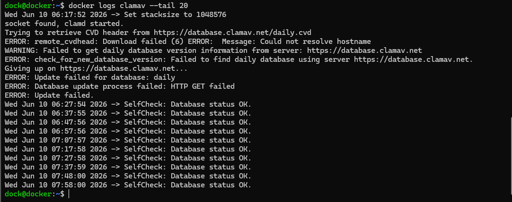

## DMZ Web Server

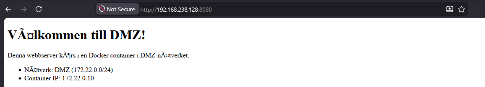

---

# Lessons Learned

This project provided practical experience with:

* Docker networking
* Linux routing
* Enterprise network segmentation
* VPN deployment
* Authentication systems
* Malware scanning
* Network troubleshooting
* Infrastructure documentation

One of the most valuable parts of the project was restoring and troubleshooting the environment after it had been offline, requiring route verification, gateway configuration, connectivity testing, and service validation.

---

# Technologies Used

* Docker
* Ubuntu Server
* Alpine Linux
* WireGuard
* Authelia
* ClamAV
* Nginx
* SSH
* ICMP
* Traceroute
* Static Routing

---

# Author

**Christoffer Öberg**

System Administration & Network Security Portfolio Project
